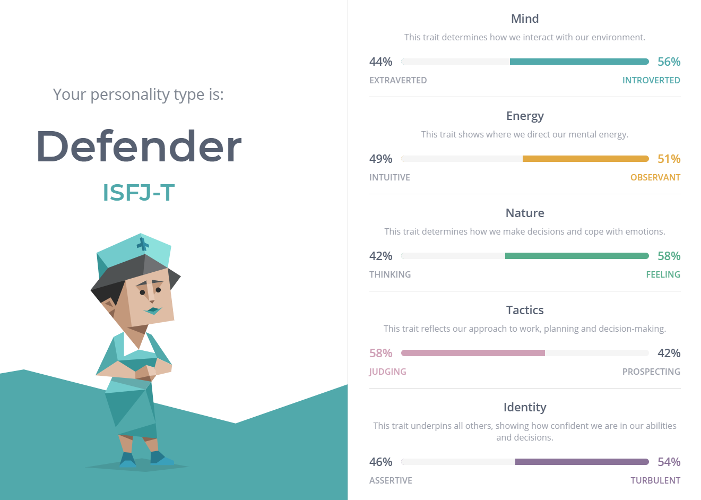
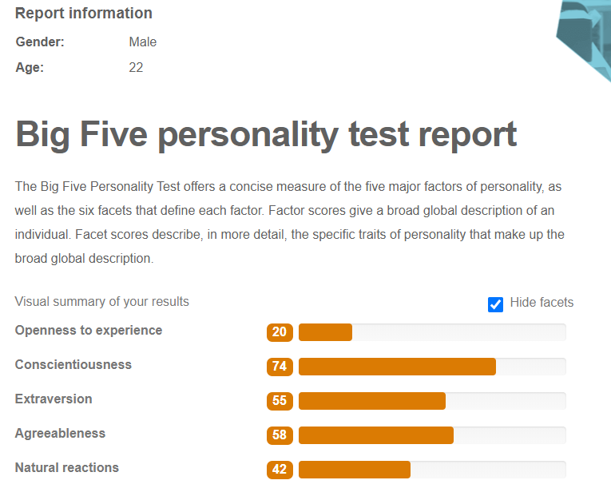

## Personal Information
###### 
 Blake Holmes, s3863219
###### 
 s3863219@students.rmit.edu.au
###### 
 https://holmesy98.github.io/Assignment1/
  Basic background: I'm from Australia, I completed my HSC 5 years ago and have been working since at a pool as a lifeguard and swim instructor. I trained the staff on how to use the new computer system. I speak English and currently learning some basic Japanese. I'd consider myself a nerd but also very sporty as I have played district and state representative level for three different sports (Soccer, basketball and swimming) but also play a lot of video games.  

### Interest in IT
 My interest in IT has stemmed from my love of computer games. Ever since I was a young kid, I've always had some type of games console. Knowing how these games and console work always were of interest to me. Pulling apart various electronic components has allowed me to gain a small idea of how these things work. I haven't really had a particular event or person that sparked my interest in the IT industry, it has always just been from being around various technology throughout my life. 
  I chose to come to RMIT as it had some of the best options of subjects inside the IT area. I am studying through Open Universities Australia and it allows me to be able to choose various subjects as electives while still being within the IT area. I have heard good things about the various computer-based subjects at RMIT and the admission process was easy to follow. 
  I expect to learn the necessary requirements for an entry level job in the IT area. While doing this course I would like to fully learn how to program using different languages and to further my skills in the IT industry. Being able to learn more than one language would definitely help with getting a job in the future.

### Ideal Job
  Something in the Artificial Intelligence/Machine Learning/Data Science area
  <a href="https://careers.cognizant.com/global/en/job/33367/Solution-Architect-Artificial-Intelligence-and-Data-Analytics">https://careers.cognizant.com/global/en/job/33367/Solution-Architect-Artificial-Intelligence-and-Data-Analytics</a>

  **Description of the position:** Artificial intelligence would be the learning of computers (eg. Tesla autopilot, Google Assistant) and their ability to perform tasks autonomously. 
  **Description of the skills:** Skills needed include a degree in Computer Science, Information Technology or Engineering Area. Having experience with different platforms. Knowledge of cloud computing and Big Data. And lots of previous experience in the IT industry.
  **Description of my skills:** I currently don't have any skills required but I am currently working towards a Bachelor's degree in Computer Science. I am self-motivated and am very organized and also have very communication and presentation skills.
  **How will I get to this stage:** Completing a Bachelor's degree in Computer Science will be the first stage. After that I would have to start gaining experience inside an IT industry by gaining an entry level job and slowly working my way towards the areas needed. Getting a job that either involves Big Data or cloud computing would allow for this process to occur quicker

## Personal Profile
  **Myer-Briggs Test:**
 
  **Online Learning Style Test:**
 
  **Further Online Test:**
 

  **What do the results mean for me:** These results show that I work well in a set environment with easy to follow instructions. I am very easy to get along with and care for others just as much as myself.
  **How will these results influence my behavior in a team:** I personally think these results will help me work within a team-based environment. They show that I am able to follow the instructions and be kind to all others in the team. Be able to help others if they did need any help if I knew something that could help
  **How should I take this into account when forming a team:** Having other people that are similar with their work flow would help me to work better. Having other people that are very organized and kind would help the team flow smoother. 

## Project Idea 
### Overview 
My project idea would be a database program that allows the storage of lots of data for a sporting club. This would allow the user to be able to check their times from a race. Being able to sort via various strokes, distance and lowest times. While doing this you would be able to search for a person's name and find all races that have been included in the database. Although swimming isn't the largest sport there still are a lot of competitors in the younger ages.
### Motivation
I think this project is important as it would allow for easy access to their times all in one place. Having the function for the times to be automatically imported from the timing program used would allow the times to be available instantly after the race finishes. This would help the coaches gauge the swimmers performances and adjust the training if necessary.
Some obstacles I could see would include the database not being able to sync with the timing software properly. The other obstacle that is possible would be being able to make it work on all platforms of mobile devices (Android, Apple and Windows).
### Description
This program would be a mobile/desktop application that would allow for swimmers to access all their times inside this one application. Whether it is a competition or just a local carnival they would all be imported to this place. Either being able to manually input the times or automatically being synced from the timing software used by each club. 
Each user would have their own login to the program. This means there would have to be a separate database that stored all the usernames and an encrypted version of the passwords. The encryption would be used in case the database was hacked and wouldn't give away user details
The program would be a simple but effective design allowing for the user to easily pick it up and not be overcomplicated. Having large buttons will allow for smaller devices to be able to use it without mis clicking. The interface would be a multiple screen based one. Each screen would be dedicated to a certain part of the program. Each part would have its own button on the home screen allowing for easy swapping between each part. Being available on different platforms may result in the user interface being slightly different for each platform but would be as close as possible to being the exact same.
  **Manual Entry** - Having a part where you can manually enter times would be one screen accessible from the home screen. This would allow the user to enter the swimmer's name, time, stroke, distance, place swam, date swam and placing in the race. The manual portion of this would be if the auto sync wasn't available at the carnival you were at.
  **Auto Entry**- Would all be synced with the computer that runs the timing software. The auto sync would include the same components as the manual, swimmer's name, time, stroke, distance, place swam, date swam and placement. This would all be behind the scenes and wouldn't have a button on the main screen.
  **Swimmers** - This would have all swimmers that are a part of your specific club or ones you could select from a larger list and set as favourites to allow easy access in the results screen.
  **Results** - Would show all the auto and manual entries in one screen. This would have the option to be sorted via any of the fields (name, time (lowest and highest), distance, stroke, place swam, date swam and finishing position).
Search feature - Would have the ability to search for a specific swimmer or event within the database
  **Add Swimmers** - This would be used to add new swimmers into the database
  **Edit** - This would be used to edit existing data that you have manually entered. It wouldn't include the automatic entries as this could cause errors within the database
  **Delete** - This is used to delete entries from within the application. It could only remove manual entries that you have put inside the database.

###  Tools and Technologies 
Software needed would include a java development environment (eg. Eclipse) for the android development and Xcode for the apple development which would require a mac. Both of these programs support the Java language so it should allow for an easy transfer of code between the two environments. The hardware required would include a small database server to host all the data. This wouldn't need to be anything too crazy as it wouldn’t be storing that much data. A good software to use for the database storage would be Microsoft Access.

### Skills Required
 The coding for both platforms is done in the same language. The skills needed would include the ability to program in the Java language and basic query scripting for the database. The database server would only have to be a really cheap setup as nothing crazy size wise would be stored on it. Having this as a basic setup would reduce the cost of purchasing/running it. Designing the user interface could be done either using the Xcode 11 SwiftUI or within the Java code, which would be a lot simpler but just as effective. 

### Outcome
The outcome of this program would be available for everyone to use on their phones or computers. The original problem would be solved with the availability of a mac computer to do all the coding for the apple and having a windows device for the android/windows development. Although the android could be developed on the mac it would then not include the windows version. The impact could result in being able to see your results a lot faster after a race instead of having to wait until they get posted later in the day.  
